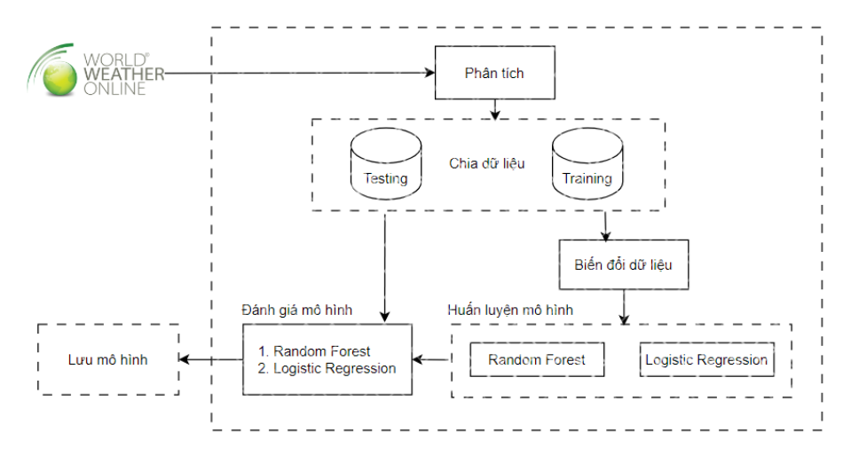
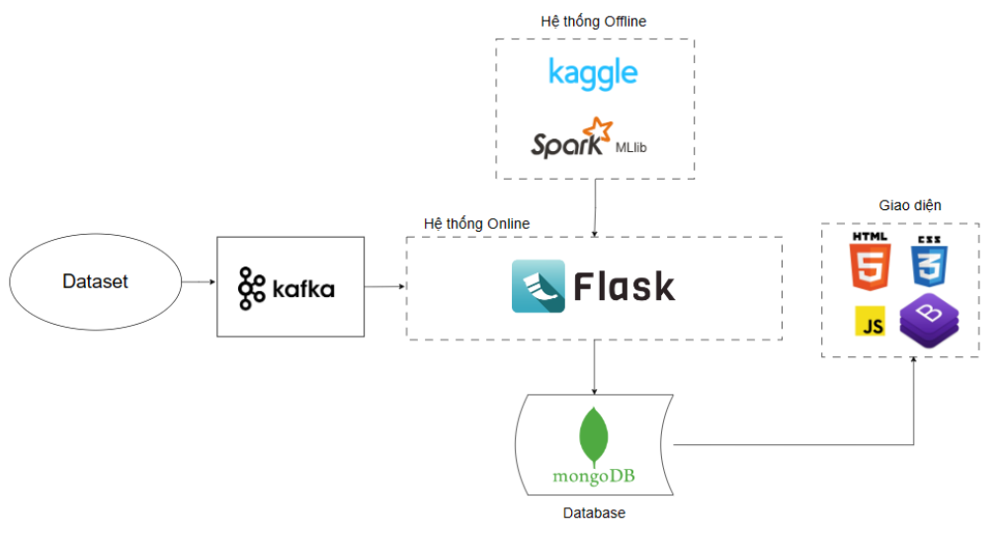
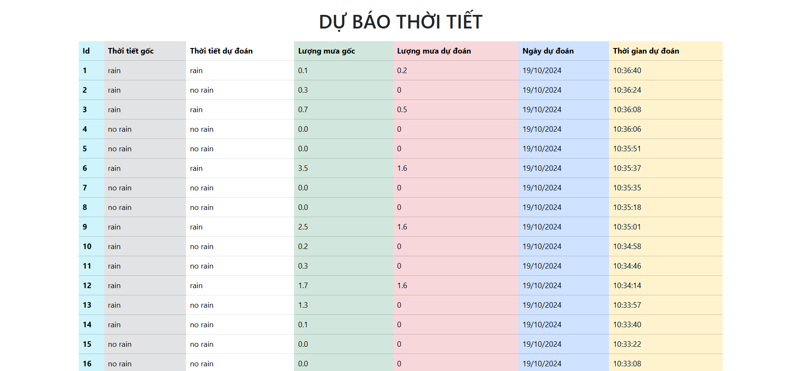

# BigData_Weather_Forecast

Weather Forecasting Project for Big Data Course IE212, UIT

This project uses Spark, Hadoop, and Kafka to input weather data into two trained models (Random Forest and Logistic Regression) to predict weather conditions (rain or no rain) and rainfall in real-time. The predictions are then displayed on a web interface.

## Setup

```text
- Python 3.10
- Java 11
- kafka_2.12-3.8.0
- Hadoop 3.3.5
- Jupyter Notebook
- MongoDB
```

During the setup and execution of the project, you might encounter compatibility issues between PySpark, Hadoop, and Java. Versions may need to be adjusted accordingly for them to work together.

NOTE:

- To use hadoop in Windows, you only need winutils.exe and hadoop.dll, no need to install the whole hadoop. I have put it in dependency/hadoop, you can refer to it.
- With Jupyter Notebook, you can install the Jupyter extension in Visual Studio Code and use it directly on VS code.

## Usage

The project has been developed and tested on Windows. I have not tested it on other operating systems.

### 1. Export model

Run `training-weather-forcast.ipynb` and `rainfall-prediction.ipynb` in `machine_learning/notebooks` to export models (I ran them in Kaggle).

Paste the models you want to use into `webapp/app/models/weather` and `webapp/app/models/amount_of_rain` to override the models in here.

Change the paths (`weather_model_path` and `rain_model_path`) to the models you want to use in `web/app/mykafka`.

NOTE: If you do not export new models but use existing models in `webapp/app/models`, you may receive errors related to these models (checksum, etc).

### 2. Create a .env file and Prepare Mongodb

Copy the contents from `.env.example` and paste them into a `.env` file in the `webapp` directory (create the file if it doesn't exist).

Edit the values in the `.env` file to suit your environment.

In MongoDB, create database with name is `DB_NAME` in `.env` and two collection `data` and `predict`.

### 3. Run Kafka

In the kafka directory, run the following commands in two separate terminals to start the Zookeeper and Kafka server:

```bash
bin\windows\zookeeper-server-start.bat config\zookeeper.properties
bin\windows\kafka-server-start.bat config\server.properties
```

### 4. Run Kafka Producer

Install the necessary libraries by running the following command:

```bash
pip install -r .\webapp\requirements.txt
```

Then, in the `machine_learning/notebooks` directory, run the `Weather_producer.ipynb` file using Jupyter Notebook (or Visual Studio Code if you have installed the Jupyter extension).

Adjust the file paths as needed.

Note: The `topic_name` in this file must match the `KAFKA_TOPIC_NAME` in the .env file.

### 5. Run the Web App

Execute the following commands to run the web app:

```bash
# Navigate to the webapp directory
cd .\webapp

# If the virtual environment is not yet created, run:
python -m venv venv

# Activate the virtual environment
## On Windows:
venv\Scripts\activate

## On macOS/Linux:
venv/bin/activate

# Install the required libraries. If any libraries are missing, manually install them.
pip install -r requirements.txt

# If you've installed additional libraries, save the dependencies to requirements.txt:
pip freeze > requirements.txt

# To run the project, execute:
python app.py

# For future runs, use the following commands:
## Window
cd .\webapp ; venv\Scripts\activate ; python app.py

## Linux
cd .\webapp && venv\Scripts\activate && python app.py

# Note: Kafka and the Producer must be running before the web app is started.
```

## Model

### Data

The weather data is sourced from <https://www.worldweatheronline.com/>

### Machine Learning Models and Components

Run the `weather-forcast.ipynb` and `rainfall-prediction.ipynb` notebook located in `machine_learning/notebooks` to train and export the models (this notebook was executed on Kaggle).

Once the model is exported, move it to the `webapp/app/models` directory. To use the model, modify two model_path variable (`weather_model_path` and `rain_model_path`) in `webapp/mykafka/consumer.py` to point to the correct model path.

### Retraining and Updating the Model

Whenever you need to update the model, rerun the notebook and export the new model.

Place the exported files in the appropriate directories (e.g., `webapp/app/models`), update the model path in `consumer.py`, and then restart the web app.

## Model Training Diagram



## System Architecture



## Web Interface


